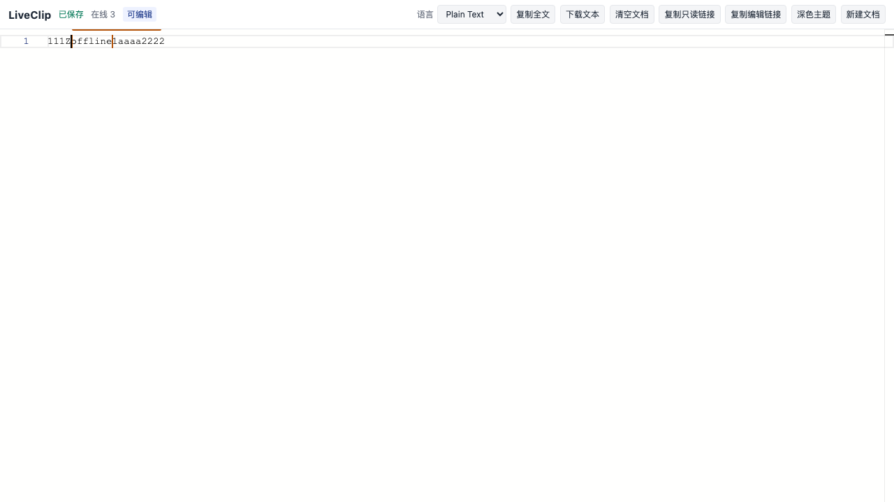

<div align="right"><a href="#liveclip">English</a> | <a href="./README.zh.md">简体中文</a></div>

<div align="center">

# LiveClip

Realtime collaborative clipboard on Cloudflare Workers.

[](https://github.com/chius-me/liveclip/releases/latest)
[](LICENSE)


</div>

Open the same link on a computer and a phone, then edit plain text or code together. Updates sync with Yjs CRDT, so concurrent typing converges instead of overwriting.

Live site: https://liveclip.chius.cc

For save-then-share, use [Clip](https://clip.chius.cc/).



## Links

| Kind      | URL                        | Access                                                        |
| --------- | -------------------------- | ------------------------------------------------------------- |
| Read-only | `/p/{roomId}`              | Sync content, cannot write                                    |
| Edit      | `/p/{roomId}#{editSecret}` | Anyone with the fragment secret can edit. No account required |

The server stores only a SHA-256 of the edit secret. Documents are deleted 30 days after the last edit.

## Architecture

One Cloudflare Worker serves the SPA, HTTP API, and WebSocket upgrade. Each document is its own Durable Object. SQLite stores the Yjs snapshot plus incremental updates. WebSockets use the Hibernation API. No VPS, Redis, D1, KV, or R2.

## Local development

Node.js 20+ is required.

```bash
npm install
npm run dev          # http://localhost:5173
npm run typecheck
npm run lint
npm test
npm run test:e2e     # first run: npx playwright install chromium
```

Do not open the built HTML via `file://`.

## Deploy

Pushes to `main` deploy through GitHub Actions. Locally:

```bash
npx wrangler login
npm run deploy
```

Repo secrets: `CLOUDFLARE_API_TOKEN` (Edit Cloudflare Workers) and `CLOUDFLARE_ACCOUNT_ID`. The custom domain `liveclip.chius.cc` is already bound.

Optional Turnstile: `wrangler secret put TURNSTILE_SECRET` and set `TURNSTILE_SITE_KEY`. Room creation skips Turnstile when it is unset.

## Limits

Plain text and code only. No accounts or history. Default cap is 1 MiB per document and 50 connections per room. Anyone with the edit link can write. Durable Objects are billed by usage.

## License

[GPL-3.0](LICENSE). The UI is inspired by [Rustpad](https://github.com/ekzhang/rustpad); none of its server code is copied.
